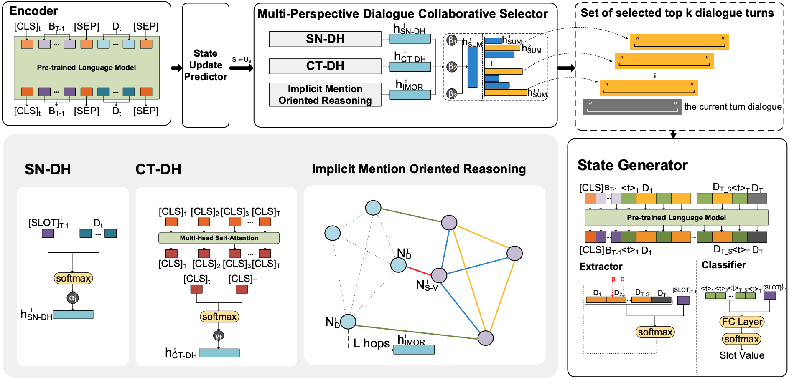

DiCoS-DST
==========

This paper/code introduces the **Beyond the Granularity: Multi-Perspective Dialogue Collaborative Selection for Dialogue State Tracking(DiCoS-DST)**

You can find the paper [here](https://aclanthology.org/2022.acl-long.165/)

See below for an overview of the model architecture:




## Requirements

Our model was trained on GPU Tesla P40 of Nvidia DGX.  

- Python 3 (tested on 3.6.8)

- PyTorch (tested on 1.6.0)

- CUDA (tested on 10.1)

- transformers (tested on 2.1.0)


The pre-trained model we used is downloaded from [huggingface](https://huggingface.co/)

- Download the [albert-large-v2](https://huggingface.co/albert-large-v2/tree/main) pre-training model, included ```config.json``` ```pytorch_model.bin``` ```spiece.model``` 

- Put ```config.json``` ```pytorch_model.bin``` ```spiece.model``` into the ```pretrained_models/albert_large``` folder


## Download and Preprocessing data

the schema/ontology is already in ```data``` folder


### MultiWOZ2.1

For the MultiWOZ2.1 dataset, the following script can be used to download and complete the pre-processing

```
python3 create_data.py --main_dir $DOWNLOAD_PATH --target_path $TARGET_PATH --mwz_ver '2.1'
```

The downloaded original dataset will be located in `$DOWNLOAD_PATH`. After preprocessing, it will output three files -- train_dials.json, dev_dials.json, and test_dials.json out put them under the `$TARGET_PATH`

or you can download it from [https://github.com/budzianowski/multiwoz](https://github.com/budzianowski/multiwoz)

Our preprocessed version can be found in the [Google Drive](https://drive.google.com/drive/folders/15Lsaevxbj9P84q8DAavEpHl42GOBTAV3?usp=sharing)


### MultiWOZ2.2

For the MultiWOZ2.2 dataset, you can download it from [https://github.com/budzianowski/multiwoz](https://github.com/budzianowski/multiwoz)

Our preprocessed version can be found in the [Google Drive](https://drive.google.com/drive/folders/1IsrlFRJOJMnJwMmGnCK8LIR8D98YzajG?usp=sharing)


### Sim-R and Sim-M

For the Sim-R and Sim-M dataset, you can download it from [https://github.com/google-research-datasets/simulated-dialogue](https://github.com/google-research-datasets/simulated-dialogue)

Our preprocessed version can be found in the [Google Drive SimM](https://drive.google.com/drive/folders/1fp_LXu9Hfk2YclXKMMWql5Vl5PfmcBKW?usp=sharing), [Google Drive SimR](https://drive.google.com/drive/folders/1iwD08nUUsD5TNSzsv9WGWmCOiwetaWd9?usp=sharing)


### DSTC2

For the DSTC2 dataset, you can download it from [https://github.com/matthen/dstc](https://github.com/matthen/dstc)

Our preprocessed version can be found in the [Google Drive](https://drive.google.com/drive/folders/1yT1rkDBUkQxpJYIJPH_yfESMYP1YAQou?usp=sharing)


## Training

Before training, make sure you have prepared all input files(```data/schema.json```, ```data/train_dials.json```, ```data/dev_dials.json```, ```data/dev_dials.json```) and pretrained models(```pretrained_models/```).


### State Update Predictor

For training of the State Update Predictor, please refer to our previous ACL 2021 work  [[paper]](https://aclanthology.org/2021.acl-long.12/) [[code]](https://github.com/guojinyu88/DSSDST)

```
@inproceedings{guo-etal-2021-dual,
    title = "Dual Slot Selector via Local Reliability Verification for Dialogue State Tracking",
    author = "Guo, Jinyu  and
      Shuang, Kai  and
      Li, Jijie  and
      Wang, Zihan",
    booktitle = "Proceedings of the 59th Annual Meeting of the Association for Computational Linguistics and the 11th International Joint Conference on Natural Language Processing (Volume 1: Long Papers)",
    month = aug,
    year = "2021",
    address = "Online",
    publisher = "Association for Computational Linguistics",
    url = "https://aclanthology.org/2021.acl-long.12",
    doi = "10.18653/v1/2021.acl-long.12",
    pages = "139--151",
    abstract = "The goal of dialogue state tracking (DST) is to predict the current dialogue state given all previous dialogue contexts. Existing approaches generally predict the dialogue state at every turn from scratch. However, the overwhelming majority of the slots in each turn should simply inherit the slot values from the previous turn. Therefore, the mechanism of treating slots equally in each turn not only is inefficient but also may lead to additional errors because of the redundant slot value generation. To address this problem, we devise the two-stage DSS-DST which consists of the Dual Slot Selector based on the current turn dialogue, and the Slot Value Generator based on the dialogue history. The Dual Slot Selector determines each slot whether to update slot value or to inherit the slot value from the previous turn from two aspects: (1) if there is a strong relationship between it and the current turn dialogue utterances; (2) if a slot value with high reliability can be obtained for it through the current turn dialogue. The slots selected to be updated are permitted to enter the Slot Value Generator to update values by a hybrid method, while the other slots directly inherit the values from the previous turn. Empirical results show that our method achieves 56.93{\%}, 60.73{\%}, and 58.04{\%} joint accuracy on MultiWOZ 2.0, MultiWOZ 2.1, and MultiWOZ 2.2 datasets respectively and achieves a new state-of-the-art performance with significant improvements.",
}
```


### Multi-Perspective Dialogue Collaborative Selector

```
sh train_model.sh
```

All model checkpoints and the temporary outputs will be saved to `./saved_models/`.


## Evaluation

To reproduce the performance as we report in the paper, you can download the trained model from Google Drive and run the evaluation script:

```
sh eval_model.sh 
```

## hint
The process of dialogue selection is a discrete process, so we multiply the score of the selected dialogue by the representation of the selected dialogue to ensure the integrality of calculation graph

## Contact

If you have any questions, you can contact Jinyu Guo(guojinyu@bupt.edu.cn), Jijie Li (lijijie@bupt.edu.cn) and Yixuan Liu(liuyixuan@bupt.edu.cn).


## Citation

```
@inproceedings{guo-etal-2022-beyond,
    title = "Beyond the Granularity: Multi-Perspective Dialogue Collaborative Selection for Dialogue State Tracking",
    author = "Guo, Jinyu  and
      Shuang, Kai  and
      Li, Jijie  and
      Wang, Zihan  and
      Liu, Yixuan",
    booktitle = "Proceedings of the 60th Annual Meeting of the Association for Computational Linguistics (Volume 1: Long Papers)",
    month = may,
    year = "2022",
    address = "Dublin, Ireland",
    publisher = "Association for Computational Linguistics",
    url = "https://aclanthology.org/2022.acl-long.165",
    pages = "2320--2332",
```
